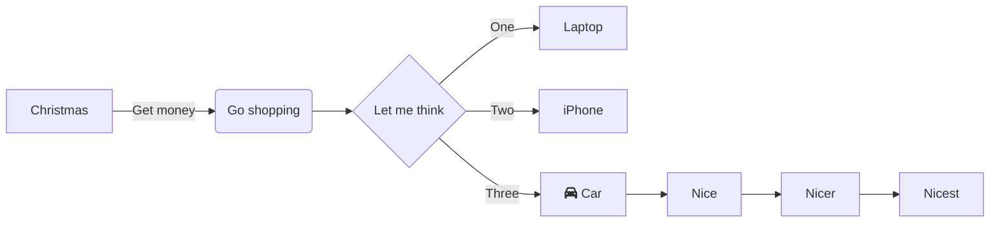
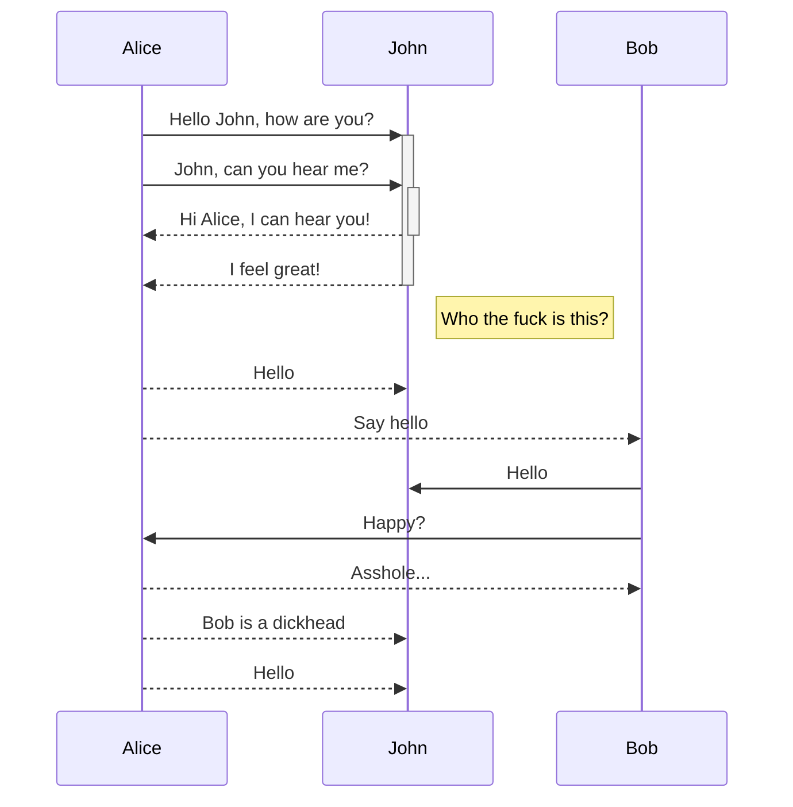

# Hello

---

## World

```ts
const x = (n: number) => n + 1
```
---

An image


---


```mermaid
graph LR
  A[Christmas] -->|Get money| B(Go shopping)
  B --> C{Let me think}
  C -->|One| D[Laptop]
  C -->|Two| E[iPhone]
  C -->|Three| F[fa:fa-car Car]
  F --> G[Nice]
  G --> H[Nicer]
  H --> I[Nicest]
```

---


```mermaid
sequenceDiagram
  Alice->>+John: Hello John, how are you?
  Alice->>+John: John, can you hear me?
  John-->>-Alice: Hi Alice, I can hear you!
  John-->>-Alice: I feel great!
  Note right of John: Who the fuck is this?
  Alice-->>John: Hello
  Alice-->>Bob: Say hello
  Bob->>John: Hello
  Bob->>Alice: Happy?
  Alice-->>Bob: Asshole...
  Alice-->>John: Bob is a dickhead
  Alice-->>John: Hello
```